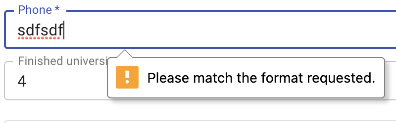
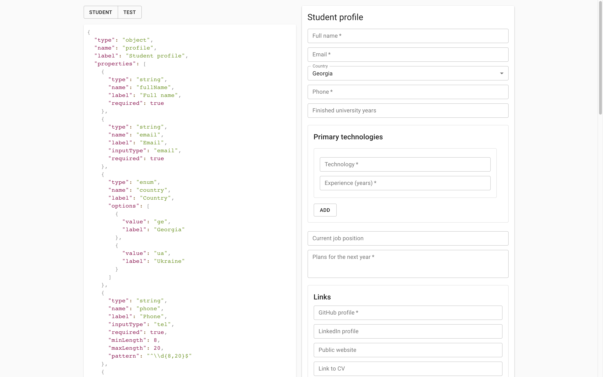
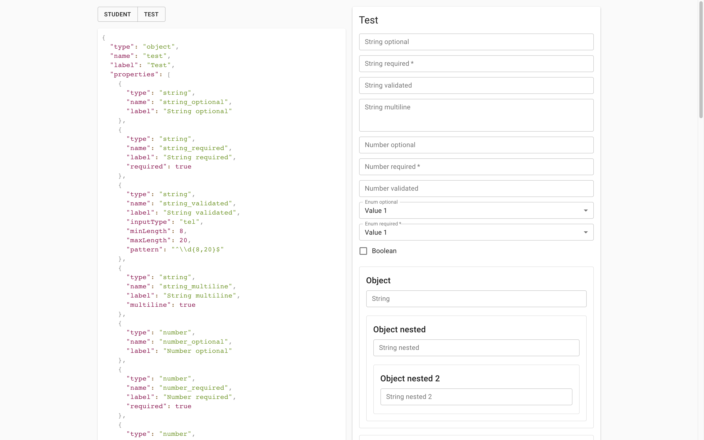
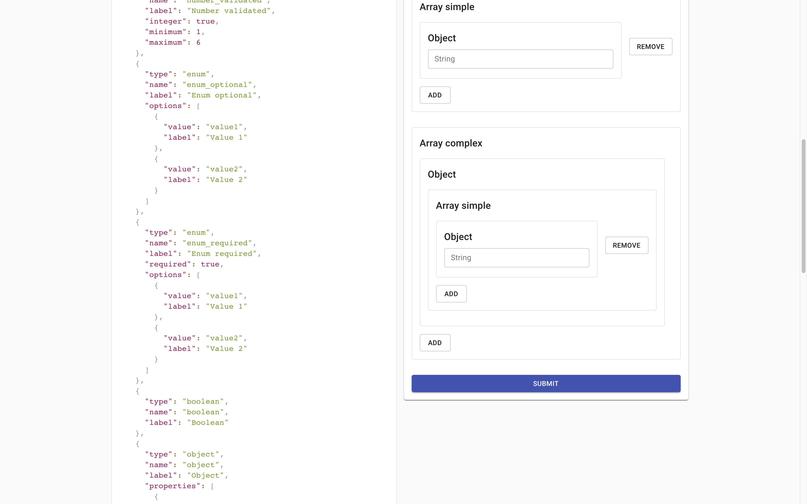
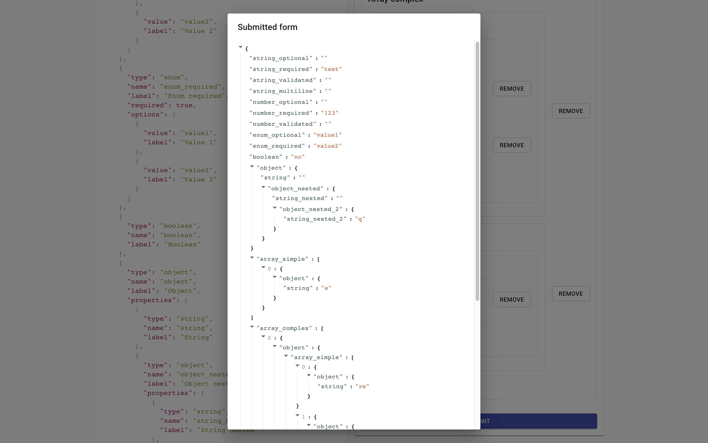

# Form builder

This repository contains the test task that covers multiple areas of development:
- Abstract thinking
- Working with HTML forms
- Working with the component framework (Angular)
- Working with Firebase hosting

The goal of the task is to build a component that takes a JSON schema as input and produces an HTML form as output. The user should be able to submit the form, and the values should be printed to console.

## Abstract

Almost every site on the web has forms. Some of them are small and independent, others are huge and complex. For some of them we can apply a built-in browser validation, for others we build custom validation rules. Some of them can be generated by a 3rd party tool, some require custom programming.

The ability to work with forms is an important skill. In this task we'll try to simplify the process of creating forms by introducing an abstraction. Please understand that the abstraction we'll create is incomplete and wrong. While simplifying the creation of simple form elements, it limits our capabilities in creating complex forms with dependent fields and custom elements.

As a result, you will have an application that renders a form described completely by the JSON schema and prints the result to console.

## Task

You need to implement a `FormBuilder` component that accepts two properties:
```ts
{
  schema: FormSchema
  onSubmit: (values: any) => void
}
```

This component should render the form described by the `schema` object, and a "Submit" button (see the screenshots below).

Once the form is attempted to be submitted, the <strong>built-in browser validation</strong> should trigger. In case of any errors in the form, the form shouldn't be submitted. You don't need to implement any custom validation or show custom errors. You need only the [built-in validation](https://developer.mozilla.org/en-US/docs/Learn/Forms/Form_validation).



The file where the major part of work should take place is [`/app/form-builder/form-builder.component.ts`](src/app/form-builder/form-builder.component.ts).

The form schemas are defined in the [`/app/schemas`](src/app/schemas) folder.

The last step is to use [Firebase Hosting](https://firebase.google.com/products/hosting) to deploy the application.

## Additional requirements

- The value of the `boolean` property should be `"on"` if checkbox is checked and `"off"` if it's unchecked. Consider using a hidden input to achieve this behavior.
- If the `array` property is marked as `required`, make sure that the user cannot remove a single item (for example you can hide the "Remove" button).

## Acceptance criteria

- The `FormBuilder` component renders a form for *any valid* `ObjectSchema` with the maximum nesting depth of 5.
- Each time the form is submitted, the values are printed to console.
- The website is hosted by the Firebase Hosting service.
- The form is user-friendly and accessible enough.
- The output JSON is NOT flat: it contains primitive types as well as objects and arrays, following the same structure (shape) as the input schema.

## Screenshots of a finished solution (EXAMPLE)

<strong>These screenshots are examples of a more complex task (that you don't have to do)! Please read the requirements!</strong>

In my app it's possible to enter any schema in the input on the left side. You DON'T need to do the same, it's just an example. Your app should work with pre-defined schemas (student and all-properties). But the program should behave correctly for any possible `ObjectSchema`.

In my app Material UI is used to build components. You DON'T need to do the same, use native HTML components! BTW, I added [Skeleton](http://getskeleton.com/) to the project to make things look a bit nicer.

In my app results are shown in a dialog window after submit. You DON'T need to do the same, just print them to the console.






## Output JSON after the `student-profile` form is submitted (EXAMPLE)

Please make sure that in your app the shape of an object for the "students" schema is EXACTLY the same as shown below:

```json
{
  "fullName": "Vlad Khitev",
  "email": "vkhitev@gmail.com",
  "country": "ua",
  "phone": "380991079098",
  "universityYears": "4",
  "technologies": [
    {
      "technology": {
        "technology": "TypeScript",
        "experience": "3"
      }
    },
    {
      "technology": {
        "technology": "React",
        "experience": "4"
      }
    }
  ],
  "currentPosition": "Head of Front-end chapter",
  "plans": "Conquer the world",
  "links": {
    "github": "https://github.com/vkhitev",
    "linkedin": "https://www.linkedin.com/in/vlad-khitev/",
    "website": "https://instagram.com/vkhitev",
    "cv": ""
  },
  "projects": [
    {
      "project": {
        "name": "Lectera",
        "link": "https://lectera.com/"
      }
    },
    {
      "technology": {
        "name": "Axterior",
        "link": "http://axterior.com/"
      }
    }
  ],
  "haveComputer": "yes"
}
```

## Q&A

### How to start?

1. Fork this repository.
2. Clone the fork and work with it.
3. Use Git to create commits (following the https://www.conventionalcommits.org/) and push them to your repository.
4. In case of any questions, DM Vlad Khitev in Telegram.
5. When the task is done, DM Vlad Khitev.

### What do I need to know to accomplish the task?

- Basic programming concepts: conditions, loops, variables, functions, recursion.
- Basic data structures: objects, arrays.
- HTML forms and validations.
- State management approach (if you decide to go with controlled components).
- Firebase hosting.
- Ability to read TypeScript types.
- Ability to use NPM in case you need to install a package.

### Do I need to care about the maximum call stack in recursion?

Let's assume that the maximum array/object nesting is 5 levels. However, it would be great if you add a restriction that the form cannot contain more than 5 levels of nested objects.

###  Can I install helper libraries from NPM?

Yes.

### Do I need to use Angular's built-in form management engine?

It's up to you. I don't care much what magic do you use to solve the task :)

### Can I modify the project config?

Please do not modify the configuration files and files that contain "Do not modify this file" at the top of it.

## Recommendations

- Do not try to do the whole task at once. Decompose it into smaller tasks:
  - Create a dumb form with hardcoded attributes. Ignore the scheme at this stage.
    - Start with simple (leaf) elements like string and numeric inputs.
    - Finish with complex elements: arrays and objects.
  - Make sure you can collect all the form data and send it to the `onSubmit` callback.
  - Hosting should be the last steps.
- Remember that the schema is recursive. The object can be nested in the object up to 5 times (artificial limitation).

## Rules (IMPORTANT)

Highest importance:
- If any kind of **plagiarism** will be detected, both original and copied works **won't be reviewed**. By plagiarism we mean stealing the code of your colleagues. Finding information in Google or StackOverflow is **allowed**!

Medium importance:
- Use Node.js version specified in `.nvmrc` file.
- Use `npm@7.x.x`. It comes automatically with the most recent version of Node.js.
- Use [VSCode](https://code.visualstudio.com/) as a code editor. Install the following extensions:
  - [EditorConfig](https://marketplace.visualstudio.com/items?itemName=EditorConfig.EditorConfig)
  - [Prettier](https://marketplace.visualstudio.com/items?itemName=esbenp.prettier-vscode)
  - [Angular service worker](https://marketplace.visualstudio.com/items?itemName=Angular.ng-template)
- Follow [Conventional Commits](https://www.conventionalcommits.org/) when working with Git.
- All tests must be passed (even if it's one test).

---

If you read this, you are a nice person. Please notify Vlad Khitev if something is not clear, and I'll update the requirements.
